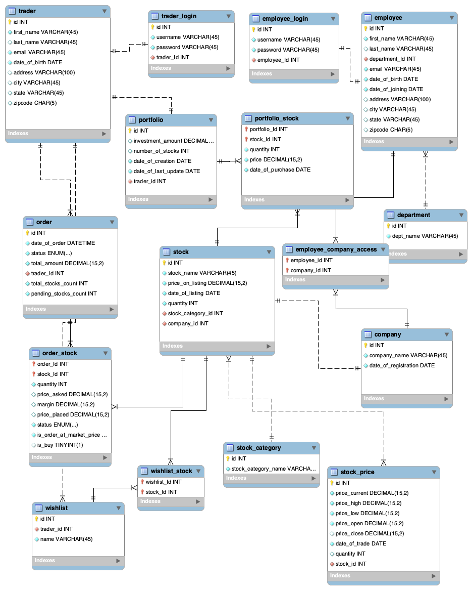

# stock-trading-platform-database

Welcome to the Stock Trading Platform Database Repository! This project contains details about the design and implementation of a SQL database for an online stock trading platform.

## Introduction

A platform that enables traders to buy and sell the stocks of companies over the internet. The main entities of the database are as follows:

* Trader - a user who buys and sells the stocks on the platform
* Company - an enterprise whose stocks are available for trading
* Stock - share of a company available for trading
* Portfolio - a group of stocks that a trader owns
* Order - a request to buy or sell a stock or group of stocks
* Employee - a user who works for the trading platform organization
* Wishlist - a group of stocks that a trader wants to track

## ER Diagram
